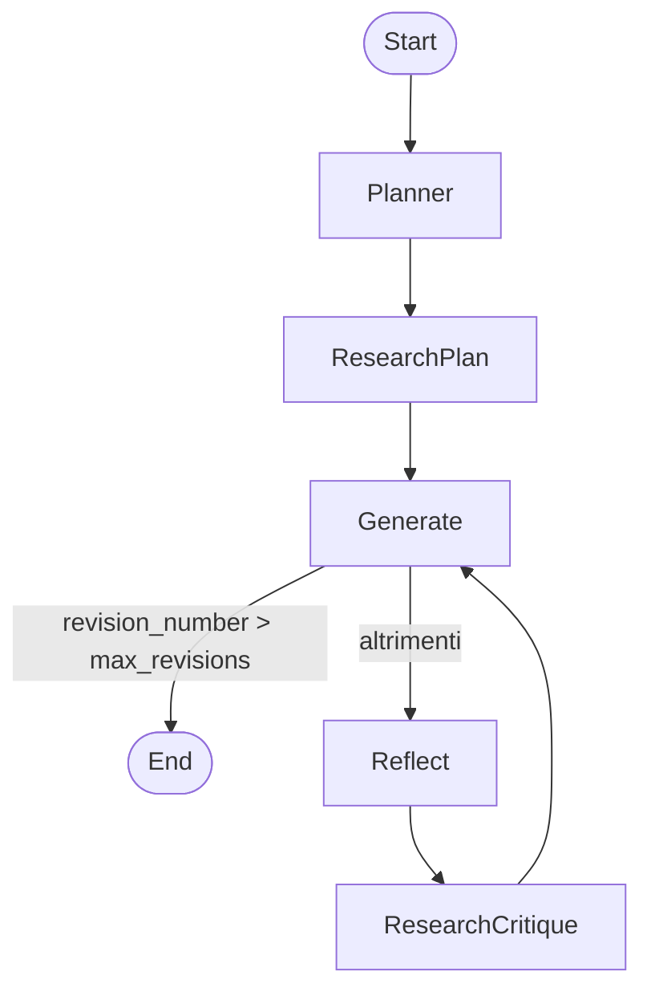

# 🧠 EssayWriterAgent

Un agente AI avanzato basato su LangGraph per la generazione iterativa di saggi, con pianificazione, ricerca documentale, stesura, riflessione e revisione automatizzata.

---

## 🎯 Obiettivo

Scrivere saggi strutturati, argomentati e informati su prompt specifici, sfruttando il reasoning step-by-step orchestrato da un grafo a stati.

Esempio: *"Qual è la differenza tra LangChain e LangSmith?"*

---

## ⚙️ Architettura del flusso



---

## 🧬 Stato condiviso (`AgentState`)

```python
class AgentState(TypedDict):
    task: str
    plan: str
    draft: str
    critique: str
    content: List[str]
    revision_number: int
    max_revisions: int
```

---

## 🧩 Componenti principali

| Nodo                | Descrizione                                           |
| ------------------- | ----------------------------------------------------- |
| `planner`           | Genera outline del saggio in forma strutturata        |
| `research_plan`     | Estrae query da eseguire e recupera contenuti esterni |
| `generate`          | Crea la bozza del saggio                              |
| `reflect`           | Fornisce critica approfondita alla bozza              |
| `research_critique` | Approfondisce punti critici e integra nuove fonti     |

---

## 📝 Esempio dettagliato di output

### Prompt iniziale

```json
{
  "task": "What is the difference between LangChain and LangSmith",
  "max_revisions": 3,
  "revision_number": 1
}
```

### 🧠 Output del nodo `planner`

```json
{
  "planner": {
    "plan": "**Title: Understanding the Differences Between LangChain and LangSmith**\n\n**I. Introduction**\n- Importance of language tools\n- Overview of LangChain and LangSmith\n\n**II. LangChain**\n- Definition, Features, Use cases, Pros/Cons\n\n**III. LangSmith**\n- Definition, Features, Use cases, Pros/Cons\n\n**IV. Comparison**\n- Architecture, UX, Performance, Community\n\n**V. Conclusion**\n- Summary and recommendations"
  }
}
```

### 🔍 Output del nodo `research_plan`

```json
{
  "research_plan": {
    "content": [
      "LangChain is ideal for rapid prototyping of LLM agents. LangSmith adds debugging and observability.",
      "LangSmith is suited for production pipelines with evaluation and trace visualization tools."
    ]
  }
}
```

### ✍️ Output del nodo `generate`

```json
{
  "generate": {
    "draft": "**Title: Understanding the Differences Between LangChain and LangSmith**\n\n**I. Introduction**\nLangChain and LangSmith are two complementary tools... [continua per 1500+ parole]",
    "revision_number": 3
  }
}
```

### 🪞 Output del nodo `reflect`

```json
{
  "reflect": {
    "critique": "The draft is clear and structured but lacks specific case studies and more technical comparisons."
  }
}
```

### 📚 Output del nodo `research_critique`

```json
{
  "research_critique": {
    "content": [
      "LangSmith provides LLM-as-Judge evaluation, traceability and orchestration dashboards.",
      "LangChain is better suited for initial development due to its modular SDK."
    ]
  }
}
```

---

## ▶️ Come eseguire

```bash
pip install -r requirements.txt
python -m EssayWriterAgent.main
```

---

## 📤 Esportazione in PDF

```python
from fpdf import FPDF

def export_draft_to_pdf(draft: str, filename="essay.pdf"):
    pdf = FPDF()
    pdf.add_page()
    pdf.set_font("Arial", size=12)
    pdf.set_auto_page_break(auto=True, margin=15)
    for line in draft.split("\n"):
        pdf.multi_cell(0, 10, line)
    pdf.output(filename)
```

---

## ⚠️ Structured Output & compatibilità modelli

Solo i seguenti modelli OpenAI supportano `structured output` via function calling:

- `gpt-3.5-turbo-0613`
- `gpt-3.5-turbo-1106`
- `gpt-4-0613`
- `gpt-4-1106-preview`
- `gpt-4o`

⚠️ Se usi `pydantic_v1.BaseModel`, LangChain imposta automaticamente `function_calling`.

---

## 📈 Tracciamento & Debug

- Traccia `thread_id`
- Ogni step del grafo stampa l'output del nodo
- Nessuno scroll laterale: ogni output viene reimpaginato per massima leggibilità

---

## 👨‍💻 Autore

**Daniele Ippoliti**\
AI Engineer & Architect\
📧 Email: [ing.ippoliti@gmail.com](mailto\:ing.ippoliti@gmail.com)\
🔗 GitHub: [@IngIppoliti](https://github.com/IngIppoliti)

---

✨ Se hai feedback, idee o vuoi collaborare, apri una pull request o contattami!

